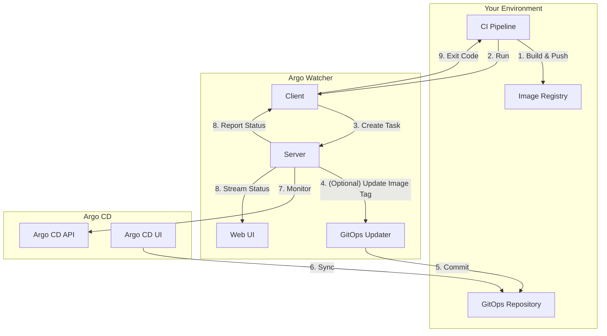

# Argo Watcher

**A feedback loop for your GitOps workflow.**

Argo Watcher bridges the gap between your CI pipeline and Argo CD, providing real-time status and visibility into your deployments. No more "fire-and-forget" deployments.

## The Problem

In a typical GitOps workflow, a CI pipeline builds an image, pushes it to a registry, and updates a Git repository. Argo CD then detects the change and deploys the new image. The problem is that the CI pipeline has no direct knowledge of the deployment's outcome. Did it succeed? Did it fail? The pipeline is left in the dark.

## The Solution

Argo Watcher introduces a control loop that monitors your Argo CD applications for health and sync status changes. It acts as a bridge, reporting the deployment's final state back to the CI pipeline. This provides a clear, synchronous result for an asynchronous process.

## Key Features

*   **Deployment Tracking**: Monitors Argo CD applications and reports on their health and sync status.
*   **CI Integration**: A lightweight client that can be integrated into any CI/CD pipeline to wait for a successful deployment.
*   **Real-time Web UI**: A comprehensive dashboard to visualize deployment status, history, and application state.
*   **Built-in GitOps Updater**: An optional, standalone service to update image tags in your GitOps repository, as an alternative to the Argo CD Image Updater.
*   **Notifications**: Send deployment status notifications to webhooks.
*   **Authentication**: Supports JWT and Keycloak for secure access to the server and UI.

## Architecture

Argo Watcher consists of three main components: the **Server**, the **Client**, and the **Web UI**.

## How It Works

1.  **Trigger**: Your CI pipeline builds a new image and pushes it to a registry.
2.  **Monitor**: The pipeline then runs the Argo Watcher client, telling it which application and image to track.
3.  **Update**: The image tag is updated in your GitOps repository, either by the Argo CD Image Updater or Argo Watcher's built-in updater.
4.  **Deploy**: Argo CD detects the change and starts deploying the new image.
5.  **Track & Report**: The Argo Watcher server continuously polls the Argo CD API. As the deployment progresses, it streams status updates to the Web UI and reports the final status (e.g., `deployed`, `failed`) back to the client.
6.  **Complete**: The client exits with a status code that reflects the deployment outcome, allowing your CI pipeline to proceed or fail accordingly.

## Documentation

For more detailed information on configuration, API usage, and advanced features, please visit our documentation at [argo-watcher.readthedocs.io](https://argo-watcher.readthedocs.io).

## Contributing

Pull requests are welcome. For major changes, please open an issue first to discuss what you would like to change.
