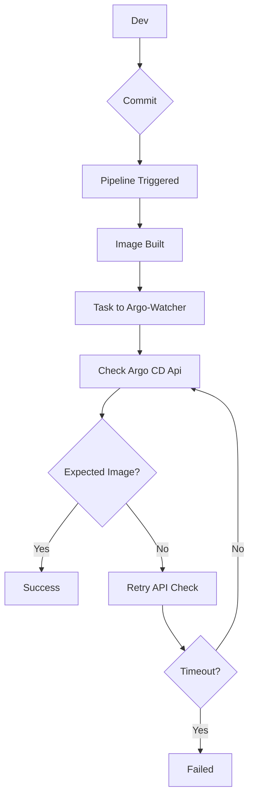

# Argo Watcher
Enhancing Deployment Visibility with Argo CD Image Updater & Direct GitOps Repository Commit Support

## Why use Argo Watcher

Argo Watcher not only addresses the critical challenge of visibility during deployments with Argo CD Image Updater but also introduces experimental support for direct commits to the GitOps repository.

It actively monitors the ArgoCD API for application changes and synchronizes the status of your image-related modifications, streamlining and potentially accelerating your deployment processes.

## Prerequisites

Argo Watcher is a standalone application, for it is designed to work with:

1. ArgoCD
2. Argo CD Image Updater
3. CI/CD solution of your choice

## Possible workflow

The workflow for deployment might be the following
1. Build and push a new image of your application
2. The next step should be a job that runs Argo Watcher Client, which triggers deployment monitoring
3. Argo CD Image Updater detects a new image and commits the changes to GitOps repo that starts the deployment
4. Throughout the deployment, ArgoWatcher monitors the current status of the Application
5. The client returns the exit code based on the resulting task status, marking the pipeline as either successful or failed

A simplified diagram

## Documentation

The up to date documentation is available on the [readthedocs.io](https://argo-watcher.readthedocs.io).

## Contributing
Pull requests are welcome. For major changes, please open an issue first to discuss what you would like to change.
