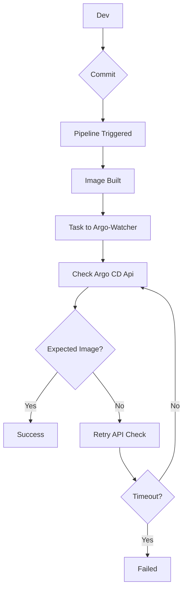

<div align="center">

# Argo Watcher
Enhancing Deployment Visibility with Argo CD Image Updater & Direct GitOps Repository Commit Support


[](https://codecov.io/gh/shini4i/argo-watcher)
[](https://goreportcard.com/report/github.com/shini4i/argo-watcher)


</div>

## Why use Argo Watcher

Argo Watcher not only addresses the critical challenge of visibility during deployments with Argo CD Image Updater but also introduces experimental support for direct commits to the GitOps repository.

It actively monitors the ArgoCD API for application changes and synchronizes the status of your image-related modifications, streamlining and potentially accelerating your deployment processes.

## Prerequisites

Argo Watcher is a standalone application, for it is designed to work with:

1. ArgoCD
2. Argo CD Image Updater
3. CI/CD solution of your choice

## Possible workflow

The workflow for deployment might be the following
1. Build and push a new image of your application
2. The next step should be a job that runs Argo Watcher Client, which triggers deployment monitoring
3. Argo CD Image Updater detects a new image and commits the changes to GitOps repo that starts the deployment
4. Throughout the deployment, ArgoWatcher monitors the current status of the Application
5. The client returns the exit code based on the resulting task status, marking the pipeline as either successful or failed

<details>
<summary>A simplified diagram</summary>
<div align="center">



</div>
</details>

## Documentation

> Starting with version v0.6.0, Argo Watcher now offers experimental support for making direct commits to the GitOps repository.

<details>
<summary>Direct Git Integration</summary>
If you've been using Argo CD Image Updater across hundreds of applications, you might have noticed that the latency in detecting new images can sometimes slow down your deployments considerably.

To address the challenges with deployment latency, we're excited to unveil an experimental feature in Argo Watcher that allows direct commits to your GitOps repository.

We remain committed to supporting the straightforward scenario where users simply check the Application status. This ensures flexibility for those who prefer or need to use the original method.

For those looking to experiment with faster image updates, you can leverage the new direct commit capability using the following annotations.

```yaml
  annotations:
    argo-watcher/managed: "true"
    argo-watcher/managed-images: "app=ghcr.io/shini4i/argo-watcher"
    argo-watcher/app.helm.image-tag: "image.tag"
```
This configuration will require mounting ssh key to the container. Support for this configuration is available in helm chart starting from verion `0.4.0`.

⚠️ Important Note Regarding Direct Commit Feature:

Please be aware that when using the direct commit feature, Argo Watcher does not verify the actual availability of the image. It assumes and trusts that the tag received from the client is correct. Ensure you have processes in place to validate image tags before relying on this feature.
</details>

- Installation instructions and more information can be found in the [docs](docs/installation.md).
- Development instructions can be found in the [docs](docs/development.md).
- A short story about why this project was created can be found [here](https://medium.com/dyninno/a-journey-to-gitops-9aa445474eb6).

## Contributing
Pull requests are welcome. For major changes, please open an issue first to discuss what you would like to change.
