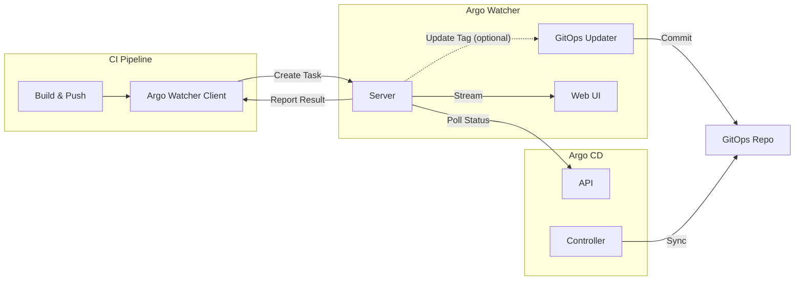

<div align="center">

# Argo Watcher

**A feedback loop for your GitOps workflow.**

Argo Watcher bridges the gap between your CI pipeline and Argo CD, providing real-time status and visibility into your deployments. No more "fire-and-forget" deployments.


[](https://codecov.io/gh/shini4i/argo-watcher)
[](https://argo-watcher.readthedocs.io/en/latest/?badge=latest)


</div>

## The problem

A CI pipeline builds an image, pushes it, and updates a Git repository. Argo CD picks the change up and deploys it — and the pipeline never learns the outcome. Did the rollout succeed? Did it fail? It reports success either way.

## The solution

Argo Watcher watches the Argo CD application for the images the pipeline just built and reports the deployment's final state back to it, turning an asynchronous process into a result the pipeline can branch on.

## Features

- **Deployment tracking** — monitors health and sync status of Argo CD applications.
- **CI client** — a small binary that waits for the deployment and exits with a matching status code.
- **Real-time Web UI** — deployment status, history, and per-task detail, pushed over a WebSocket.
- **Built-in GitOps updater** — optionally commits image tags to your GitOps repository, replacing Argo CD Image Updater.
- **Deployment lock** — freeze deployments on a schedule or on demand.
- **Notifications** — webhook or Mattermost, on deployment start and result.
- **Authentication** — a deploy token or JWT for pipelines, any OIDC provider (Keycloak, Authentik, …) for the Web UI.

## Architecture


```mermaid
graph LR
    subgraph CI["CI Pipeline"]
        Build["Build & Push"]
        Client["Argo Watcher Client"]
    end

    subgraph AW["Argo Watcher"]
        Server["Server"]
        Updater["GitOps Updater"]
        WebUI["Web UI"]
    end

    subgraph ACD["Argo CD"]
        API["API"]
        Controller["Controller"]
    end

    GitRepo["GitOps Repo"]

    Build --> Client
    Client -- "Create Task" --> Server
    Server -. "Update Tag (optional)" .-> Updater
    Updater -- "Commit" --> GitRepo
    Controller -- "Sync" --> GitRepo
    Server -- "Poll Status" --> API
    Server -- "Stream" --> WebUI
    Server -- "Report Result" --> Client
```

## How it works

1. Your pipeline builds and pushes an image, then runs the Argo Watcher client with the application and image to track.
2. The tag is updated in your GitOps repository — by Argo Watcher's built-in updater, or by Argo CD Image Updater.
3. Argo CD syncs, while the server polls its API and streams the task's progress to the Web UI.
4. The final status (`deployed`, `failed`, …) goes back to the client, which exits accordingly, and your pipeline proceeds or fails.

## Getting started

The fastest way to try Argo Watcher is the bundled Docker Compose stack. It runs the server, a Postgres database, the Web UI, and a mock Argo CD, so you can exercise the full task lifecycle locally without a cluster:

```bash
git clone https://github.com/shini4i/argo-watcher.git
cd argo-watcher
docker compose up
```

Once it is up, the Web UI is available at [http://localhost:3100](http://localhost:3100). The [Quick Start](https://argo-watcher.readthedocs.io/en/latest/getting-started/quick-start/) walks through submitting a task and watching it deploy.

To deploy to a real Kubernetes cluster with Helm and wire the client (`ghcr.io/shini4i/argo-watcher-client`) into your CI pipeline, follow the [Installation guide](https://argo-watcher.readthedocs.io/en/latest/guides/install/).

## Documentation

Configuration, the API, and every guide: [argo-watcher.readthedocs.io](https://argo-watcher.readthedocs.io).

## Contributing

Contributions are welcome — **open an issue before writing code**. What a change needs to satisfy is in [CONTRIBUTING.md](.github/CONTRIBUTING.md); local setup is in the [Development guide](https://argo-watcher.readthedocs.io/en/latest/contributing/development/).

## License

This project is licensed under the [Apache License 2.0](LICENSE).
