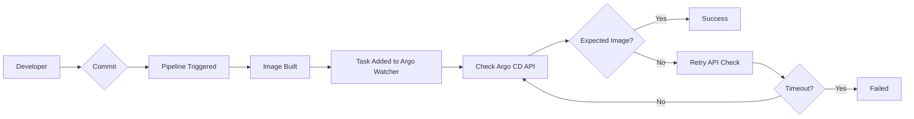
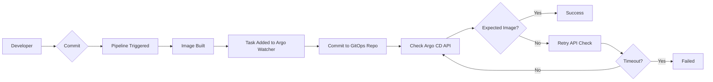

# Concepts

## What is Argo Watcher?

A feedback loop for your GitOps workflow. Argo Watcher bridges the gap between your CI pipeline and Argo CD, providing real-time status and visibility into your deployments. Stop guessing whether your deployment succeeded — Argo Watcher tells your pipeline exactly what happened.

## The Problem

In a typical GitOps workflow, a CI pipeline builds an image, pushes it to a registry, and updates a Git repository. Argo CD then detects the change and deploys the new image. The problem is that the CI pipeline has **no direct knowledge of the deployment outcome**. Did it succeed? Did it fail? The pipeline is left in the dark.

## The Solution

Argo Watcher introduces a control loop that monitors your Argo CD applications for health and sync status changes. It acts as a bridge, reporting the deployment's final state back to the CI pipeline. This provides a clear, synchronous result for an asynchronous process.

## Architecture: Server, Client, and Updater

Argo Watcher is composed of three concerns. The **Server** is the long-running service that talks to Argo CD, persists task state, exposes the HTTP API, and serves the Web UI. The **Client** is a lightweight CLI that runs inside CI/CD pipelines — it creates a task, waits for the result, and exits with a status code that the pipeline can branch on. The **Updater** is an optional subsystem inside the server that commits image-tag changes to your GitOps repository, replacing Argo CD Image Updater for projects that prefer a single tool.

The Web UI is bundled with the server and gives operators a real-time view of every task as it transitions through its lifecycle.

## Task Lifecycle

A task in Argo Watcher moves through the following states:

1. **Pending** — Task created, waiting for the expected image to appear in Argo CD.
2. **In Progress** — Image detected in Argo CD, deployment is syncing or running.
3. **Deployed** — Deployment succeeded; application is healthy and synced.
4. **Failed** — Deployment failed due to health/sync issues or timeout.

## Deployment Locking

Deployment locking allows you to pause new deployments during maintenance windows or emergency situations. When a deployment is locked, new tasks will fail if their application is locked. Locks can be scheduled or manual and include annotations describing why the lock was applied.

## Built-in GitOps Updater vs Argo CD Image Updater

Argo Watcher can update image tags in your GitOps repository in two ways:

- **Argo CD Image Updater** — A separate tool that watches registries and commits tag updates. Argo Watcher only monitors the deployment.
- **Built-in GitOps Updater** — Argo Watcher commits image updates itself, eliminating the need for a separate tool.

Use the built-in updater if you want a simpler architecture. Use Argo CD Image Updater if you prefer a decoupled design or have complex image scanning requirements.

## Deployment Workflows

Argo Watcher supports two primary workflows depending on how image tags are updated in your GitOps repository.

### With Argo CD Image Updater

In this workflow, Argo Watcher only monitors the deployment. The image tag update is handled by Argo CD Image Updater.

### With Built-in GitOps Updater

In this workflow, Argo Watcher handles both the image tag update and deployment monitoring, eliminating the need for Argo CD Image Updater entirely.

