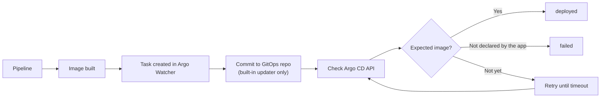

# Concepts

## The problem

A CI pipeline builds an image, pushes it, and updates a Git repository. Argo CD picks the change up and deploys it. The pipeline never learns the outcome: it cannot tell a successful rollout from a failed one, so it reports success as soon as the commit lands.

## The solution

Argo Watcher watches the Argo CD application for the images the pipeline just built and reports the deployment's final state back to it — turning an asynchronous process into a result the pipeline can branch on.

## Server, client, and updater

- **Server** — the long-running service. It talks to Argo CD, persists task state, exposes the HTTP API, and serves the Web UI, which shows every task in real time.
- **Client** — a small CLI for CI/CD pipelines. It creates a task, waits for the result, and exits with a matching status code.
- **Updater** — an optional part of the server that commits image-tag changes to your GitOps repository, replacing Argo CD Image Updater.

## Task lifecycle

`POST /api/v1/tasks` answers `202 Accepted` with `"status": "accepted"`; the task itself is stored as **in progress** and then moves to one of the terminal states below.

| Status | Meaning |
|---|---|
| `in progress` | Waiting for the requested images to be running, synced, and healthy. |
| `deployed` | The application is synced and healthy with the requested images. |
| `failed` | Argo CD reported a health or sync failure, `DEPLOYMENT_TIMEOUT` elapsed, or the application finished rolling out without ever declaring the requested image (see [Image is not part of application](../operations/troubleshooting.md#image-is-not-part-of-application)). |
| `app not found` | Argo CD has no application with that name, or the token cannot see it. Counted under `unconfirmed_deployment_failures`, or under `failed_deployment` in the rarer case where an application that was already confirmed disappeared mid-rollout. |
| `aborted` | The outcome could not be confirmed: Argo CD was unreachable during the check, or the task sat in progress past the staleness window. Counts as a failure — under `failed_deployment` when Argo CD had already confirmed the application, under `unconfirmed_deployment_failures` when it never did; `argocd_unavailable` tells you whether Argo CD was the reason. |
| `cancelled` | Superseded by a newer deployment of one of the same images before reaching a final state; polling stops. Not counted as a failure. |

Every terminal status also increments `deployments_total{app,result}` once the deployment ends, provided Argo CD confirmed the application — see [Observability](../operations/observability.md#metrics).

Two rules keep supersession from cancelling unrelated work: only in-progress tasks that share an image with the new deployment are cancelled, and a deployment can only cancel one that presented no more authority than itself — a task submitted without a credential never cancels one submitted with a valid deploy token or JWT.

## Deployment locking

A lock pauses new deployments, either on a [schedule](../guides/deployment-lock.md#scheduled-lockdown) or [manually](../guides/deployment-lock.md#manual-lockdown), for maintenance windows and emergencies. While it is held every deploy request is rejected. The lock is server-global; there is no per-application lock.

## Built-in updater vs Argo CD Image Updater

Argo Watcher can reach your GitOps repository in two ways:

- **Built-in GitOps updater** — Argo Watcher commits the image tag itself. One tool, and the commit happens at deploy time instead of on a scan interval.
- **Argo CD Image Updater** — a separate tool watches the registry and commits; Argo Watcher only monitors the rollout.

Pick the built-in updater for a simpler architecture, Image Updater if you want registry scanning or a decoupled design. Either way the monitoring half is identical:

```mermaid
graph LR
    Pipeline[Pipeline] --> Docker[Image built]
    Docker --> Task[Task created in Argo Watcher]
    Task --> Update["Commit to GitOps repo<br/>(built-in updater only)"]
    Update --> Check[Check Argo CD API]
    Check --> Decision{Expected image?}
    Decision -->|Yes| Success[deployed]
    Decision -->|Not declared by the app| Failed[failed]
    Decision -->|Not yet| Retry[Retry until timeout]
    Retry --> Check
```
