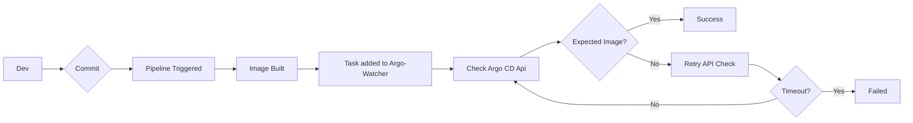
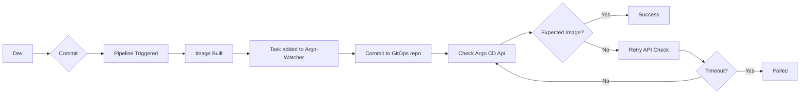

---
hide:
- navigation
---
# argo-watcher

<figure markdown>
  { width="700" }
  <figcaption>Web UI example</figcaption>
</figure>

## General information

Argo Watcher not only addresses the critical challenge of visibility during deployments with Argo CD Image Updater but also introduces experimental support for direct commits to the GitOps repository.

It actively monitors the ArgoCD API for application changes and synchronizes the status of your image-related modifications, streamlining and potentially accelerating your deployment processes.

## Potential use cases

A simplified diagram of the possible workflow using ArgoCD Image Updater:

or a workflow using direct commits:

