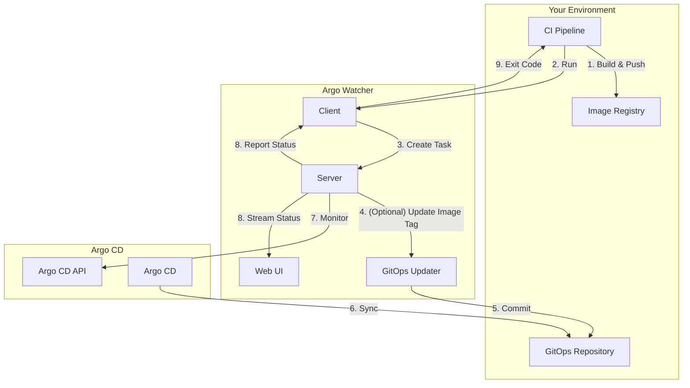
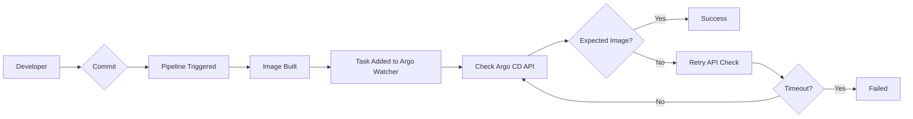
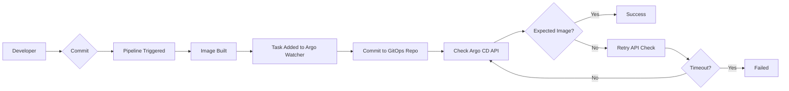

# Argo Watcher

**A feedback loop for your GitOps workflow.**

Argo Watcher bridges the gap between your CI pipeline and Argo CD, providing real-time status and visibility into your deployments. Stop guessing whether your deployment succeeded -- Argo Watcher tells your pipeline exactly what happened.

<figure markdown="span">
  { width="700" loading=lazy }
  <figcaption>The Argo Watcher dashboard showing deployment status and history</figcaption>
</figure>

## The Problem

In a typical GitOps workflow, a CI pipeline builds an image, pushes it to a registry, and updates a Git repository. Argo CD then detects the change and deploys the new image. The problem is that the CI pipeline has **no direct knowledge of the deployment outcome**. Did it succeed? Did it fail? The pipeline is left in the dark.

## The Solution

Argo Watcher introduces a control loop that monitors your Argo CD applications for health and sync status changes. It acts as a bridge, reporting the deployment's final state back to the CI pipeline. This provides a clear, synchronous result for an asynchronous process.

## Key Features

- **Deployment Tracking** -- Monitors Argo CD applications and reports on their health and sync status in real time.
- **CI Integration** -- A lightweight client that integrates into any CI/CD pipeline (GitLab CI, GitHub Actions, and others) to wait for a successful deployment.
- **Real-time Web UI** -- A comprehensive dashboard to visualize deployment status, history, and application state.
- **Built-in GitOps Updater** -- An optional service to update image tags in your GitOps repository, replacing the need for Argo CD Image Updater.
- **Webhook Notifications** -- Send deployment status notifications to external services via configurable webhooks.
- **Authentication** -- Supports JWT tokens and Keycloak for secure access to the server and UI.
- **Deployment Locking** -- Schedule maintenance windows or manually lock deployments to prevent unintended changes.

## Architecture

Argo Watcher consists of three main components: the **Server**, the **Client**, and the **Web UI**.

```mermaid
graph TD
    subgraph "Your Environment"
        CI_Pipeline[CI Pipeline]
        Git_Repo[GitOps Repository]
        Image_Registry[Image Registry]
    end

    subgraph "Argo Watcher"
        Watcher_Server[Server]
        Watcher_Client[Client]
        Watcher_WebUI[Web UI]
        Watcher_Updater[GitOps Updater]
    end

    subgraph "Argo CD"
        ArgoCD_API[Argo CD API]
        ArgoCD[Argo CD]
    end

    CI_Pipeline -- "1. Build & Push" --> Image_Registry
    CI_Pipeline -- "2. Run" --> Watcher_Client
    Watcher_Client -- "3. Create Task" --> Watcher_Server
    Watcher_Server -- "4. (Optional) Update Image Tag" --> Watcher_Updater
    Watcher_Updater -- "5. Commit" --> Git_Repo
    Watcher_Server -- "7. Monitor" --> ArgoCD_API
    ArgoCD -- "6. Sync" --> Git_Repo
    Watcher_Server -- "8. Stream Status" --> Watcher_WebUI
    Watcher_Server -- "8. Report Status" --> Watcher_Client
    Watcher_Client -- "9. Exit Code" --> CI_Pipeline
```

## How It Works

1. **Trigger** -- Your CI pipeline builds a new image and pushes it to a registry.
2. **Monitor** -- The pipeline runs the Argo Watcher client, specifying which application and image to track.
3. **Update** -- The image tag is updated in your GitOps repository, either by Argo CD Image Updater or by Argo Watcher's built-in updater.
4. **Deploy** -- Argo CD detects the change and starts deploying the new image.
5. **Track and Report** -- The Argo Watcher server continuously polls the Argo CD API and streams status updates to the Web UI. Once the deployment reaches a terminal state, it reports the result back to the client.
6. **Complete** -- The client exits with a status code that reflects the deployment outcome, allowing your CI pipeline to proceed or fail accordingly.

## Deployment Workflows

Argo Watcher supports two primary workflows depending on how image tags are updated in your GitOps repository.

### With Argo CD Image Updater

In this workflow, Argo Watcher only monitors the deployment. The image tag update is handled by Argo CD Image Updater.

```mermaid
graph LR
    Dev[Developer] --> Commit{Commit}
    Commit --> Pipeline[Pipeline Triggered]
    Pipeline --> Docker[Image Built]
    Docker --> Task[Task Added to Argo Watcher]
    Task --> Check[Check Argo CD API]
    Check --> Decision{Expected Image?}
    Decision -->|Yes| Success[Success]
    Decision -->|No| Retry[Retry API Check]
    Retry --> Timeout{Timeout?}
    Timeout -->|Yes| Failed[Failed]
    Timeout -->|No| Check
```

### With Built-in GitOps Updater

In this workflow, Argo Watcher handles both the image tag update and deployment monitoring, eliminating the need for Argo CD Image Updater entirely.

```mermaid
graph LR
    Dev[Developer] --> Commit{Commit}
    Commit --> Pipeline[Pipeline Triggered]
    Pipeline --> Docker[Image Built]
    Docker --> Task[Task Added to Argo Watcher]
    Task --> ImageUpdate[Commit to GitOps Repo]
    ImageUpdate --> Check[Check Argo CD API]
    Check --> Decision{Expected Image?}
    Decision -->|Yes| Success[Success]
    Decision -->|No| Retry[Retry API Check]
    Retry --> Timeout{Timeout?}
    Timeout -->|Yes| Failed[Failed]
    Timeout -->|No| Check
```

## Quick Start

Ready to get started? Head to the [Installation](installation.md) guide for step-by-step setup instructions covering both the server and client components.

If you want to use Argo Watcher's built-in GitOps updater instead of Argo CD Image Updater, see the [Git Integration](git-integration.md) guide after completing the initial setup.
