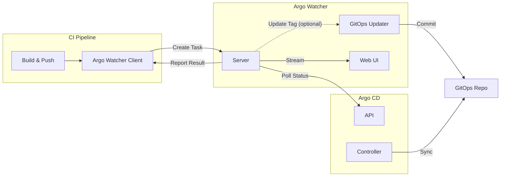

# Argo Watcher

**A feedback loop for your GitOps workflow.**

Argo Watcher bridges the gap between your CI pipeline and Argo CD, providing real-time status and visibility into your deployments. Stop guessing whether your deployment succeeded — Argo Watcher tells your pipeline exactly what happened.

```mermaid
graph LR
    subgraph CI["CI Pipeline"]
        Build["Build & Push"]
        Client["Argo Watcher Client"]
    end

    subgraph AW["Argo Watcher"]
        Server["Server"]
        Updater["GitOps Updater"]
        WebUI["Web UI"]
    end

    subgraph ACD["Argo CD"]
        API["API"]
        Controller["Controller"]
    end

    GitRepo["GitOps Repo"]

    Build --> Client
    Client -- "Create Task" --> Server
    Server -. "Update Tag (optional)" .-> Updater
    Updater -- "Commit" --> GitRepo
    Controller -- "Sync" --> GitRepo
    Server -- "Poll Status" --> API
    Server -- "Stream" --> WebUI
    Server -- "Report Result" --> Client
```

## Get Started

- :material-lightning-bolt: **Quick Start**

    Get a running instance in 5 minutes with Docker Compose.

    [Run the demo →](getting-started/quick-start.md)

- :material-book-open-outline: **Concepts**

    Understand the problem, architecture, and key ideas.

    [Learn the basics →](getting-started/concepts.md)

- :material-api: **API Reference**

    Explore the REST API with interactive examples.

    [Browse endpoints →](reference/api.md)

- :material-wrench-outline: **Operations**

    Monitor, troubleshoot, and maintain your Argo Watcher deployment.

    [View guides →](operations/troubleshooting.md)

