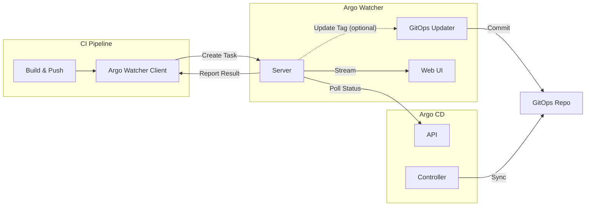

---
hide:
  - navigation
  - toc
---

# Argo Watcher

**Wait for an Argo CD deployment from your CI pipeline, and learn whether the image you just built rolled out.**

Argo Watcher tracks Argo CD deployments for CI/CD pipelines. After a pipeline builds and pushes an image, the Argo Watcher client waits for that exact image to be deployed and exits with success or failure, so the pipeline can act on it. A feedback loop for your GitOps workflow, with an optional built-in GitOps updater. Coming from `argocd app wait`? Start with [Wait for an Argo CD Deployment from CI](guides/ci-pipeline-wait.md).

If a page looks wrong, [open an issue](https://github.com/shini4i/argo-watcher/issues) or use the pencil icon at the top right to suggest a fix.

```mermaid
graph LR
    subgraph CI["CI Pipeline"]
        Build["Build & Push"]
        Client["Argo Watcher Client"]
    end

    subgraph AW["Argo Watcher"]
        Server["Server"]
        Updater["GitOps Updater"]
        WebUI["Web UI"]
    end

    subgraph ACD["Argo CD"]
        API["API"]
        Controller["Controller"]
    end

    GitRepo["GitOps Repo"]

    Build --> Client
    Client -- "Create Task" --> Server
    Server -. "Update Tag (optional)" .-> Updater
    Updater -- "Commit" --> GitRepo
    Controller -- "Sync" --> GitRepo
    Server -- "Poll Status" --> API
    Server -- "Stream" --> WebUI
    Server -- "Report Result" --> Client
```

## Get Started

- :material-lightning-bolt: **Quick Start**

    Get a running instance in 5 minutes with Docker Compose.

    [Run the demo →](getting-started/quick-start.md)

- :material-book-open-outline: **Concepts**

    Understand the problem, architecture, and key ideas.

    [Learn the basics →](getting-started/concepts.md)

- :material-api: **API Reference**

    Explore the REST API with interactive examples.

    [Browse endpoints →](reference/api.md)

- :material-wrench-outline: **Operations**

    Monitor, troubleshoot, and maintain your Argo Watcher deployment.

    [View guides →](operations/troubleshooting.md)

